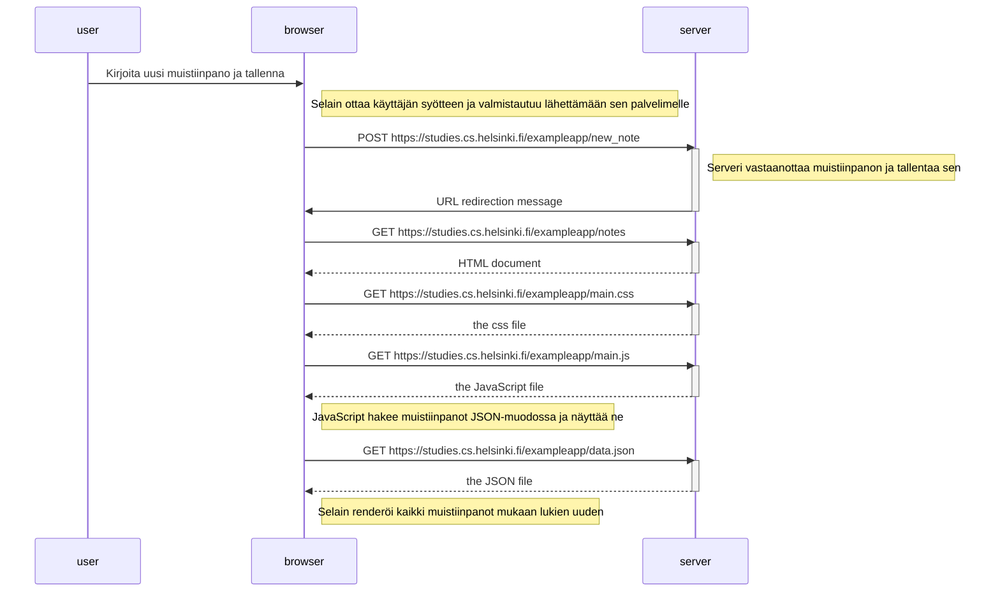

```mermaid
sequenceDiagram
    participant user
    participant browser
    participant server

    user->>browser: Kirjoita uusi muistiinpano ja tallenna
    Note right of browser: Selain ottaa käyttäjän syötteen ja valmistautuu lähettämään sen palvelimelle

    browser->>server: POST https://studies.cs.helsinki.fi/exampleapp/new_note
    activate server 
    Note right of server: Serveri vastaanottaa muistiinpanon ja tallentaa sen 
    server->>browser: URL redirection message
    deactivate server

    browser->>server: GET https://studies.cs.helsinki.fi/exampleapp/notes
    activate server
    server-->>browser: HTML document
    deactivate server
    
    browser->>server: GET https://studies.cs.helsinki.fi/exampleapp/main.css
    activate server
    server-->>browser: the css file
    deactivate server
    
    browser->>server: GET https://studies.cs.helsinki.fi/exampleapp/main.js
    activate server
    server-->>browser: the JavaScript file
    deactivate server
   
    Note right of browser: JavaScript hakee muistiinpanot JSON-muodossa ja näyttää ne
    
    browser->>server: GET https://studies.cs.helsinki.fi/exampleapp/data.json
    activate server
    server-->>browser: the JSON file
    deactivate server    

    Note right of browser: Selain renderöi kaikki muistiinpanot mukaan lukien uuden
```
