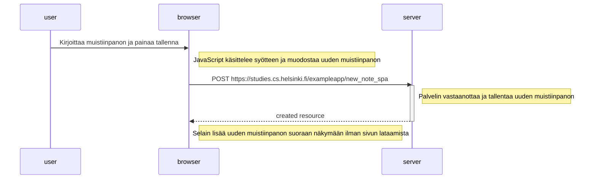

```mermaid
sequenceDiagram
    participant user
    participant browser
    participant server

    user->>browser: Kirjoittaa muistiinpanon ja painaa tallenna
    Note right of browser: JavaScript käsittelee syötteen ja muodostaa uuden muistiinpanon

    browser->>server: POST https://studies.cs.helsinki.fi/exampleapp/new_note_spa
    activate server

    Note right of server: Palvelin vastaanottaa ja tallentaa uuden muistiinpanon
    server-->>browser: created resource
    deactivate server

    Note right of browser: Selain lisää uuden muistiinpanon suoraan näkymään ilman sivun lataamista
```